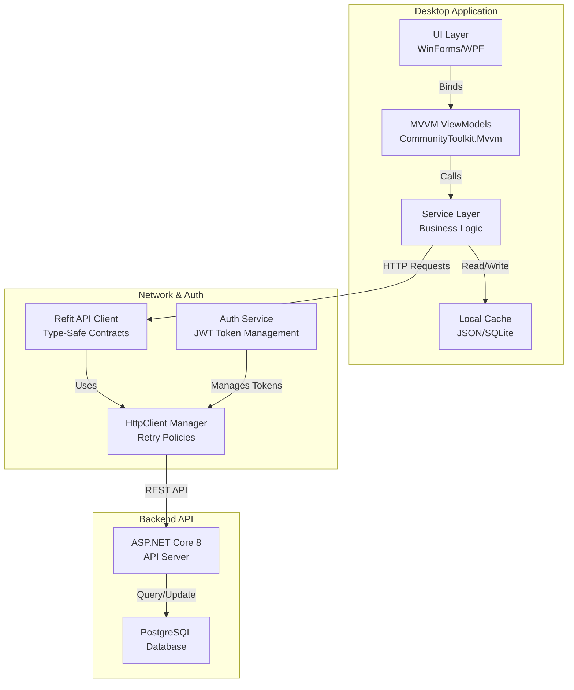
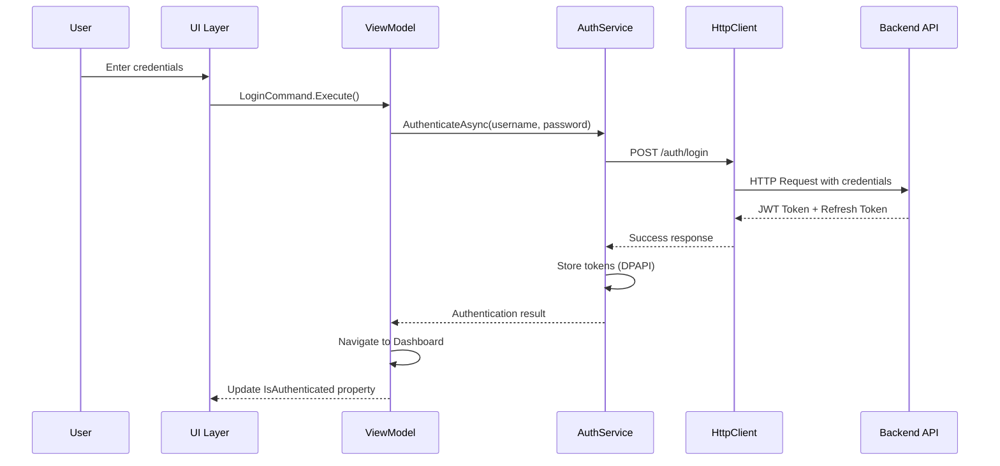
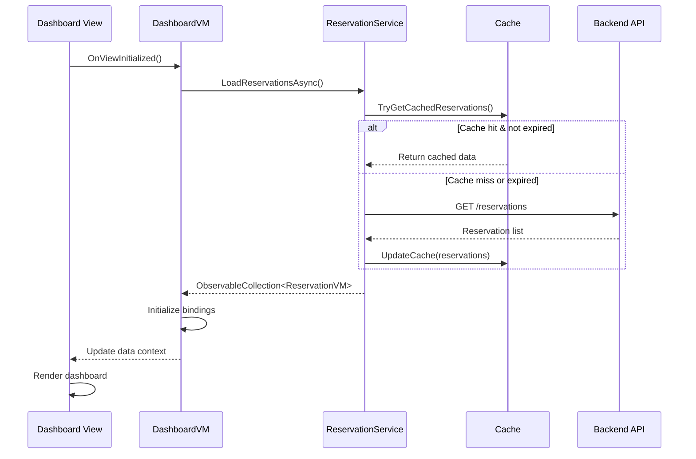

# Design Document: Naar-Noor Desktop Application

## Overview

The Naar-Noor Desktop Application is a Windows-first native desktop client built with .NET 8+ that provides restaurant staff and managers with a comprehensive management interface. Leveraging Windows Forms initially with planned WPF evolution, the application integrates seamlessly with the existing ASP.NET Core API backend, eliminating code duplication through shared DTOs and business logic. The desktop client supports bilingual interfaces (English/Arabic) and follows MVVM architectural patterns enhanced with Community Toolkit utilities for maintainability, testability, and scalability.

**Key Objectives:**
- Deliver a native Windows experience with responsive MVVM architecture
- Reuse backend business logic and DTOs through HTTP API client (Refit)
- Support bilingual UI with runtime language switching
- Provide staff and management dashboards with real-time data
- Scale from Windows Forms to WPF without architectural refactoring
- Enable comprehensive offline-capable caching and sync mechanisms

## High-Level Architecture

### System Architecture Diagram



### Core Components & Interactions

**1. Presentation Layer (UI)**
- Windows Forms: Initial UI implementation with legacy-compatible components
- WPF Evolution Path: XAML-based modern UI with data binding capabilities
- Supports both English/Arabic layouts with RTL/LTR switching
- Responsive to screen DPI and accessibility requirements

**2. MVVM Layer**
- Uses Microsoft.Toolkit.Mvvm for base class implementations
- Automatic PropertyChanged notifications via [ObservableProperty] attribute
- Relay commands for user interactions with automatic CanExecute evaluation
- Dependency injection throughout for testability
- Two-way data binding from Views to ViewModels

**3. Service Layer**
- Encapsulates business logic separate from UI concerns
- Manages authentication state and token lifecycle
- Orchestrates API calls with error handling and retry logic
- Provides data caching and synchronization
- Handles culture/localization context

**4. API Client (Refit)**
- Type-safe HTTP client interface definitions matching backend endpoints
- Automatic serialization/deserialization of DTOs
- Request/response interception for authentication headers
- Centralized error handling and retry policies

**5. Local Storage & Caching**
- JSON file-based storage for application configuration
- SQLite database for complex queries and offline scenarios
- Implements cache-first-with-sync pattern for reliability
- Automatic cache invalidation based on TTL

**6. Authentication & Security**
- JWT token management with automatic refresh
- Secure token storage using Windows Data Protection API (DPAPI)
- Request signing for sensitive operations
- Role-based access control (RBAC) enforcement
- Refresh token rotation and revocation

### Sequence Diagram: Authentication Flow



### Sequence Diagram: Dashboard Data Load



## Architectural Layers

### Layer 1: Presentation (UI Layer)

**Windows Forms Phase:**
- Form-based views for each feature module
- DataGridView for tabular data with sorting/filtering
- Custom controls for bilingual support
- Event-driven interactions triggering ViewModel commands

**WPF Evolution Phase:**
- Migrate to UserControl/Window architecture
- Leverage XAML data binding with INotifyPropertyChanged
- Implement converters for culture-specific formatting
- Use attached behaviors for complex interactions

**Language Support:**
- ResourceDictionary for string resources (English/Arabic)
- RTL layout support via FlowLayoutPanel (Forms) or FlowDirection (WPF)
- Runtime culture switching without application restart
- Persistent language preference in local config

### Layer 2: MVVM ViewModels

**ViewModel Structure:**
```csharp
// Base pattern using CommunityToolkit.Mvvm
[ObservableRecipient]
public partial class DashboardViewModel : ObservableObject
{
    [ObservableProperty]
    private ObservableCollection<ReservationViewModel> reservations;
    
    [ObservableProperty]
    private bool isLoading;
    
    [RelayCommand]
    private async Task RefreshReservations()
    {
        IsLoading = true;
        try
        {
            var data = await _reservationService.GetReservationsAsync();
            Reservations = new(data);
        }
        finally { IsLoading = false; }
    }
}
```

**Command Binding:**
- RelayCommand for synchronous actions
- AsyncRelayCommand for async operations with cancellation support
- Automatic CanExecute re-evaluation on property changes
- Command parameter binding for context-specific data

### Layer 3: Service Layer

**Services Responsibilities:**
- Authentication & Token Management (AuthenticationService)
- Business logic orchestration (ReservationService, MenuService, etc.)
- Data caching and synchronization (CacheService)
- Error handling with user-friendly messaging
- Localization/culture management (LocalizationService)

**Service Dependency Injection:**
```csharp
// Registered in IServiceProvider
services.AddSingleton<IAuthenticationService, AuthenticationService>();
services.AddSingleton<IReservationService, ReservationService>();
services.AddSingleton<IMenuService, MenuService>();
services.AddSingleton<ICacheService, CacheService>();
services.AddSingleton<ILocalizationService, LocalizationService>();
```

### Layer 4: API Client Layer (Refit Interfaces)

**Refit Contract Patterns:**
```csharp
public interface IAuthApi
{
    [Post("/api/auth/login")]
    Task<ApiResponse<LoginResponse>> LoginAsync(LoginRequest request);
    
    [Post("/api/auth/refresh")]
    Task<ApiResponse<TokenResponse>> RefreshTokenAsync(RefreshTokenRequest request);
}

public interface IReservationApi
{
    [Get("/api/reservations")]
    Task<ApiResponse<List<ReservationDto>>> GetReservationsAsync(
        [Query] DateTime? fromDate,
        [Query] DateTime? toDate
    );
}
```

**HttpClient Configuration:**
- Automatic retry policies (exponential backoff)
- Request timeout policies (30s default)
- Authentication header injection via DelegatingHandler
- Gzip compression for request/response bodies
- Circuit breaker for cascading failures

### Layer 5: Data Access & Caching

**Cache Strategy:**
- **L1 Cache:** In-memory ObservableCollections in ViewModels (fastest)
- **L2 Cache:** SQLite for complex queries and offline access
- **L3 Cache:** JSON file storage for configuration and small datasets

**Cache Invalidation:**
- TTL-based expiration (configurable per data type)
- Manual invalidation after mutations
- Automatic refresh on data change notifications
- Cascading invalidation for related entities

**Offline Capability:**
- Last-known-good data stored in SQLite
- Queue unsent operations for batch sync
- Conflict resolution on reconnection (last-write-wins)

## Low-Level Design

### Project Structure

```
desktop/
├── src/
│   ├── NaarNoor.Desktop.Common/
│   │   ├── Models/
│   │   │   ├── Auth/
│   │   │   ├── Reservation/
│   │   │   ├── Menu/
│   │   │   └── ...
│   │   ├── Services/
│   │   │   ├── IAuthenticationService.cs
│   │   │   ├── IReservationService.cs
│   │   │   ├── ICacheService.cs
│   │   │   └── ...
│   │   ├── DTOs/
│   │   │   ├── Requests/
│   │   │   └── Responses/
│   │   ├── Constants/
│   │   └── Utilities/
│   │
│   ├── NaarNoor.Desktop.WinForms/
│   │   ├── Forms/
│   │   │   ├── LoginForm.cs
│   │   │   ├── DashboardForm.cs
│   │   │   ├── ReservationForm.cs
│   │   │   ├── MenuForm.cs
│   │   │   └── ...
│   │   ├── ViewModels/
│   │   │   ├── LoginViewModel.cs
│   │   │   ├── DashboardViewModel.cs
│   │   │   ├── ReservationViewModel.cs
│   │   │   └── ...
│   │   ├── Services/
│   │   │   ├── Implementation/
│   │   │   ├── ApiClients/
│   │   │   └── CacheService.cs
│   │   ├── Resources/
│   │   │   ├── en.xaml / en.resx
│   │   │   └── ar.xaml / ar.resx
│   │   ├── App.xaml / Program.cs
│   │   └── Configuration/
│   │       └── ServiceConfiguration.cs
│   │
│   ├── NaarNoor.Desktop.Tests/
│   │   ├── Services/
│   │   ├── ViewModels/
│   │   ├── Mocks/
│   │   └── ...
│   │
│   └── NaarNoor.Desktop.Installer/ (optional)
│       ├── MSIX packaging
│       └── Setup configuration
│
├── NaarNoor.Desktop.sln
├── README.md
└── .gitignore
```

### Core Service Interfaces

**IAuthenticationService**


```csharp
public interface IAuthenticationService
{
    Task<Result<LoginResponse>> AuthenticateAsync(string username, string password);
    Task<Result<TokenResponse>> RefreshTokenAsync();
    Task LogoutAsync();
    bool IsAuthenticated { get; }
    string? CurrentUserId { get; }
    string? CurrentUserRole { get; }
}
```

**IReservationService**

```csharp
public interface IReservationService
{
    Task<Result<List<ReservationDto>>> GetReservationsAsync(
        DateTime? fromDate = null, 
        DateTime? toDate = null
    );
    Task<Result<ReservationDto>> GetReservationByIdAsync(string id);
    Task<Result<ReservationDto>> CreateReservationAsync(CreateReservationRequest request);
    Task<Result<ReservationDto>> UpdateReservationAsync(string id, UpdateReservationRequest request);
    Task<Result> DeleteReservationAsync(string id);
    IObservable<ReservationNotification> ReservationUpdates { get; }
}
```

**IMenuService**

```csharp
public interface IMenuService
{
    Task<Result<List<MenuItemDto>>> GetMenuItemsAsync();
    Task<Result<MenuItemDto>> GetMenuItemByIdAsync(string id);
    Task<Result<MenuItemDto>> CreateMenuItemAsync(CreateMenuItemRequest request);
    Task<Result<MenuItemDto>> UpdateMenuItemAsync(string id, UpdateMenuItemRequest request);
    Task<Result> DeleteMenuItemAsync(string id);
}
```

**ICacheService**

```csharp
public interface ICacheService
{
    Task<T?> GetAsync<T>(string key);
    Task SetAsync<T>(string key, T value, TimeSpan? expiration = null);
    Task RemoveAsync(string key);
    Task ClearAsync();
    void InvalidatePattern(string pattern);
}
```

### Refit API Client Interfaces

```csharp
public interface IAuthApiClient
{
    [Post("/api/auth/login")]
    Task<ApiResponse<LoginResponse>> LoginAsync([Body] LoginRequest request);
    
    [Post("/api/auth/refresh")]
    [Headers("Authorization: Bearer")]
    Task<ApiResponse<TokenResponse>> RefreshTokenAsync([Body] RefreshTokenRequest request);
    
    [Post("/api/auth/logout")]
    [Headers("Authorization: Bearer")]
    Task<ApiResponse> LogoutAsync();
}

public interface IReservationApiClient
{
    [Get("/api/reservations")]
    [Headers("Authorization: Bearer")]
    Task<ApiResponse<PagedResponse<ReservationDto>>> GetReservationsAsync(
        [Query] int? page = null,
        [Query] int? pageSize = null,
        [Query] DateTime? fromDate = null,
        [Query] DateTime? toDate = null
    );
    
    [Get("/api/reservations/{id}")]
    [Headers("Authorization: Bearer")]
    Task<ApiResponse<ReservationDto>> GetReservationByIdAsync(string id);
    
    [Post("/api/reservations")]
    [Headers("Authorization: Bearer")]
    Task<ApiResponse<ReservationDto>> CreateReservationAsync([Body] CreateReservationRequest request);
    
    [Put("/api/reservations/{id}")]
    [Headers("Authorization: Bearer")]
    Task<ApiResponse<ReservationDto>> UpdateReservationAsync(
        string id, 
        [Body] UpdateReservationRequest request
    );
    
    [Delete("/api/reservations/{id}")]
    [Headers("Authorization: Bearer")]
    Task<ApiResponse> DeleteReservationAsync(string id);
}

public interface IMenuApiClient
{
    [Get("/api/menu")]
    [Headers("Authorization: Bearer")]
    Task<ApiResponse<List<MenuItemDto>>> GetMenuItemsAsync();
    
    [Get("/api/menu/{id}")]
    [Headers("Authorization: Bearer")]
    Task<ApiResponse<MenuItemDto>> GetMenuItemByIdAsync(string id);
    
    [Post("/api/menu")]
    [Headers("Authorization: Bearer")]
    Task<ApiResponse<MenuItemDto>> CreateMenuItemAsync([Body] CreateMenuItemRequest request);
    
    [Put("/api/menu/{id}")]
    [Headers("Authorization: Bearer")]
    Task<ApiResponse<MenuItemDto>> UpdateMenuItemAsync(
        string id, 
        [Body] UpdateMenuItemRequest request
    );
    
    [Delete("/api/menu/{id}")]
    [Headers("Authorization: Bearer")]
    Task<ApiResponse> DeleteMenuItemAsync(string id);
}
```

### HttpClient Configuration

```csharp
public static class HttpClientConfiguration
{
    public static IServiceCollection AddHttpClientServices(
        this IServiceCollection services, 
        IConfiguration config
    )
    {
        var baseUrl = config["Api:BaseUrl"] ?? "http://localhost:5000";
        
        services
            .AddRefitClient<IAuthApiClient>()
            .ConfigureHttpClient(client => 
            {
                client.BaseAddress = new Uri(baseUrl);
                client.Timeout = TimeSpan.FromSeconds(30);
            })
            .AddPolicyHandler(GetRetryPolicy())
            .AddPolicyHandler(GetCircuitBreakerPolicy())
            .AddHttpMessageHandler<AuthenticationHeaderHandler>();
        
        services
            .AddRefitClient<IReservationApiClient>()
            .ConfigureHttpClient(client => 
            {
                client.BaseAddress = new Uri(baseUrl);
                client.Timeout = TimeSpan.FromSeconds(30);
            })
            .AddPolicyHandler(GetRetryPolicy())
            .AddHttpMessageHandler<AuthenticationHeaderHandler>();
        
        // Additional API clients registered similarly
        
        return services;
    }
    
    private static IAsyncPolicy<HttpResponseMessage> GetRetryPolicy()
    {
        return HttpPolicyExtensions
            .HandleTransientHttpError()
            .WaitAndRetryAsync(new[]
            {
                TimeSpan.FromSeconds(1),
                TimeSpan.FromSeconds(2),
                TimeSpan.FromSeconds(4)
            });
    }
    
    private static IAsyncPolicy<HttpResponseMessage> GetCircuitBreakerPolicy()
    {
        return HttpPolicyExtensions
            .HandleTransientHttpError()
            .CircuitBreakerAsync(
                handledEventsAllowedBeforeBreaking: 5,
                durationOfBreak: TimeSpan.FromSeconds(30)
            );
    }
}
```

### Authentication Header Handler

```csharp
public class AuthenticationHeaderHandler : DelegatingHandler
{
    private readonly IAuthenticationService _authService;
    
    public AuthenticationHeaderHandler(IAuthenticationService authService)
    {
        _authService = authService;
    }
    
    protected override async Task<HttpResponseMessage> SendAsync(
        HttpRequestMessage request, 
        CancellationToken cancellationToken
    )
    {
        if (_authService.IsAuthenticated)
        {
            var token = await _authService.GetCurrentTokenAsync();
            request.Headers.Authorization = new("Bearer", token);
        }
        
        var response = await base.SendAsync(request, cancellationToken);
        
        if (response.StatusCode == System.Net.HttpStatusCode.Unauthorized)
        {
            await _authService.RefreshTokenAsync();
            if (_authService.IsAuthenticated)
            {
                var newToken = await _authService.GetCurrentTokenAsync();
                request.Headers.Authorization = new("Bearer", newToken);
                response = await base.SendAsync(request, cancellationToken);
            }
        }
        
        return response;
    }
}
```

### ViewModel Base Class with MVVM Toolkit

```csharp
[ObservableRecipient]
public abstract class ViewModelBase : ObservableObject
{
    protected readonly IServiceProvider ServiceProvider;
    protected readonly ILocalizationService LocalizationService;
    
    [ObservableProperty]
    private string? errorMessage;
    
    [ObservableProperty]
    private bool isLoading;
    
    public ViewModelBase(IServiceProvider serviceProvider)
    {
        ServiceProvider = serviceProvider;
        LocalizationService = serviceProvider.GetRequiredService<ILocalizationService>();
    }
    
    protected async Task<Result<T>> ExecuteAsync<T>(
        Func<Task<Result<T>>> operation,
        string errorContext = "Operation failed"
    )
    {
        try
        {
            IsLoading = true;
            ErrorMessage = null;
            return await operation();
        }
        catch (Exception ex)
        {
            ErrorMessage = $"{errorContext}: {ex.Message}";
            return Result<T>.Failure(ex.Message);
        }
        finally
        {
            IsLoading = false;
        }
    }
    
    protected void SetError(string message) => ErrorMessage = message;
    protected void ClearError() => ErrorMessage = null;
}
```

### Example ViewModel: ReservationViewModel

```csharp
[ObservableRecipient]
public partial class ReservationViewModel : ViewModelBase
{
    private readonly IReservationService _reservationService;
    
    [ObservableProperty]
    private ObservableCollection<ReservationItemViewModel> reservations = new();
    
    [ObservableProperty]
    private DateTime selectedDate = DateTime.Today;
    
    [ObservableProperty]
    private ReservationItemViewModel? selectedReservation;
    
    [ObservableProperty]
    private bool showNewReservationForm;
    
    public ReservationViewModel(
        IServiceProvider serviceProvider,
        IReservationService reservationService
    ) : base(serviceProvider)
    {
        _reservationService = reservationService;
    }
    
    [RelayCommand]
    public async Task LoadReservations()
    {
        var result = await ExecuteAsync(
            async () =>
            {
                var dtos = await _reservationService.GetReservationsAsync(
                    SelectedDate, 
                    SelectedDate.AddDays(1)
                );
                
                if (dtos.IsSuccess)
                {
                    var items = dtos.Value
                        .Select(r => new ReservationItemViewModel(r))
                        .ToObservableCollection();
                    
                    Reservations = items;
                }
                
                return dtos;
            },
            "Failed to load reservations"
        );
    }
    
    [RelayCommand]
    public void ShowNewReservationDialog() => ShowNewReservationForm = true;
    
    [RelayCommand]
    public async Task SaveReservation(CreateReservationRequest request)
    {
        var result = await ExecuteAsync(
            async () => await _reservationService.CreateReservationAsync(request),
            "Failed to create reservation"
        );
        
        if (result.IsSuccess)
        {
            ShowNewReservationForm = false;
            await LoadReservationsCommand.ExecuteAsync(null);
        }
    }
    
    [RelayCommand]
    public async Task DeleteReservation(string reservationId)
    {
        if (MessageBox.Show(
            LocalizationService.GetString("ConfirmDelete"),
            LocalizationService.GetString("Confirmation"),
            MessageBoxButtons.YesNo
        ) != DialogResult.Yes)
            return;
        
        var result = await ExecuteAsync(
            async () => await _reservationService.DeleteReservationAsync(reservationId),
            "Failed to delete reservation"
        );
        
        if (result.IsSuccess)
        {
            Reservations.Remove(Reservations.FirstOrDefault(r => r.Id == reservationId));
        }
    }
    
    public override void OnNavigatedTo()
    {
        base.OnNavigatedTo();
        _ = LoadReservationsCommand.ExecuteAsync(null);
    }
}
```

### Configuration Management

```csharp
public class AppConfiguration
{
    public string? ApiBaseUrl { get; set; }
    public string? Culture { get; set; } = "en";
    public int CacheTtlMinutes { get; set; } = 30;
    public bool EnableOfflineMode { get; set; } = true;
}

public class ConfigurationService
{
    private const string ConfigFilePath = "app-config.json";
    private AppConfiguration _config = new();
    
    public async Task LoadConfigurationAsync()
    {
        try
        {
            if (File.Exists(ConfigFilePath))
            {
                var json = await File.ReadAllTextAsync(ConfigFilePath);
                _config = JsonSerializer.Deserialize<AppConfiguration>(json) ?? new();
            }
        }
        catch { /* Log and use defaults */ }
    }
    
    public async Task SaveConfigurationAsync()
    {
        var json = JsonSerializer.Serialize(
            _config,
            new JsonSerializerOptions { WriteIndented = true }
        );
        await File.WriteAllTextAsync(ConfigFilePath, json);
    }
    
    public T Get<T>(string key, T defaultValue) => /* Implementation */;
    public void Set<T>(string key, T value) => /* Implementation */;
}
```

### Error Handling & Result Pattern

```csharp
public class Result<T>
{
    public bool IsSuccess { get; }
    public T? Value { get; }
    public string? Error { get; }
    
    private Result(T value)
    {
        IsSuccess = true;
        Value = value;
        Error = null;
    }
    
    private Result(string error)
    {
        IsSuccess = false;
        Value = default;
        Error = error;
    }
    
    public static Result<T> Success(T value) => new(value);
    public static Result<T> Failure(string error) => new(error);
    
    public Result<U> Map<U>(Func<T, U> selector) =>
        IsSuccess
            ? Result<U>.Success(selector(Value!))
            : Result<U>.Failure(Error!);
}

public class Result
{
    public bool IsSuccess { get; }
    public string? Error { get; }
    
    private Result(bool isSuccess, string? error)
    {
        IsSuccess = isSuccess;
        Error = error;
    }
    
    public static Result Success() => new(true, null);
    public static Result Failure(string error) => new(false, error);
}
```

### Localization Service

```csharp
public interface ILocalizationService
{
    string GetString(string key);
    string GetString(string key, params object[] args);
    void SetCulture(string cultureName);
    string CurrentCulture { get; }
    IObservable<string> CultureChanged { get; }
}

public class LocalizationService : ILocalizationService
{
    private readonly Subject<string> _cultureChanged = new();
    private string _currentCulture = "en";
    
    public string CurrentCulture => _currentCulture;
    public IObservable<string> CultureChanged => _cultureChanged.AsObservable();
    
    private Dictionary<string, Dictionary<string, string>> _resources = new();
    
    public string GetString(string key)
    {
        return _resources
            .TryGetValue(_currentCulture, out var dict) 
            && dict.TryGetValue(key, out var value)
            ? value
            : key;
    }
    
    public string GetString(string key, params object[] args)
    {
        return string.Format(GetString(key), args);
    }
    
    public void SetCulture(string cultureName)
    {
        _currentCulture = cultureName;
        Thread.CurrentThread.CurrentUICulture = CultureInfo.GetCultureInfo(cultureName);
        _cultureChanged.OnNext(cultureName);
    }
    
    public async Task LoadResourcesAsync()
    {
        // Load from embedded resource files or external XAML/JSON files
    }
}
```

### Dependency Injection Configuration

```csharp
public static class ServiceConfiguration
{
    public static IServiceProvider ConfigureServices(IConfiguration configuration)
    {
        var services = new ServiceCollection();
        
        // Configuration
        services.AddSingleton(configuration);
        services.AddSingleton<ConfigurationService>();
        
        // HTTP Clients
        services.AddHttpClientServices(configuration);
        
        // Localization
        services.AddSingleton<ILocalizationService, LocalizationService>();
        
        // Authentication
        services.AddSingleton<IAuthenticationService, AuthenticationService>();
        
        // Business Services
        services.AddSingleton<IReservationService, ReservationService>();
        services.AddSingleton<IMenuService, MenuService>();
        services.AddSingleton<IChefService, ChefService>();
        services.AddSingleton<IStaffService, StaffService>();
        services.AddSingleton<IReportService, ReportService>();
        
        // Caching
        services.AddSingleton<ICacheService, CacheService>();
        
        // ViewModels
        services.AddTransient<LoginViewModel>();
        services.AddTransient<DashboardViewModel>();
        services.AddTransient<ReservationViewModel>();
        services.AddTransient<MenuViewModel>();
        services.AddTransient<StaffViewModel>();
        services.AddTransient<ReportViewModel>();
        
        return services.BuildServiceProvider();
    }
}
```

## Key Functional Specifications

### Login Flow

**Preconditions:**
- Application is running
- Network connectivity exists
- User has valid credentials

**Postconditions:**
- User authenticated with valid JWT token
- Token stored securely (DPAPI)
- Dashboard view loaded with user data
- Access control applied based on user role

**Error Scenarios:**
- Invalid credentials → Display error, clear form, allow retry
- Network timeout → Offer offline mode or retry
- Invalid token response → Log error, show generic message

### Dashboard Initialization

**Preconditions:**
- User authenticated
- Cache initialized
- Network connectivity (optional if offline enabled)

**Postconditions:**
- All widgets populated with current data
- Real-time subscriptions established (if supported)
- Cache synchronized with server
- UI responsive to user interactions

**Loop Invariant (Data Refresh):**
- Each data refresh cycle: cache validity checked before API call
- Failed API calls fallback to cache without disrupting UI

### Menu Management CRUD

**Preconditions:**
- User authenticated with manager/admin role
- Menu item data valid

**Postconditions:**
- Backend database updated
- Cache invalidated for affected collections
- UI refreshed with new state
- Audit log recorded

**Validation Rules:**
- Name: non-empty, max 100 chars
- Price: positive numeric, max 2 decimals
- Category: must exist in system
- Description: optional, max 500 chars

### Reservation Booking

**Preconditions:**
- User authenticated with staff/manager role
- Reservation date valid (future date)
- Table availability confirmed

**Postconditions:**
- Reservation created in database
- Confirmation email sent (async)
- Calendar view updated
- Notification sent to relevant staff

**Conflict Resolution:**
- Double-booking prevention: check table availability before commit
- Race condition handling: optimistic locking with version numbers
- Timeout handling: queued for retry if network issue

## Testing Strategy

### Unit Testing

**Coverage Goals:** >80% for service layer

**Test Framework:** xUnit + Moq

**Key Test Scenarios:**
- Service method success paths
- Error handling and recovery
- Cache hit/miss scenarios
- ViewModel command execution
- Result mapping and composition

**Example Test:**

```csharp
[Fact]
public async Task CreateReservation_WithValidRequest_ReturnsSuccess()
{
    // Arrange
    var mockApiClient = new Mock<IReservationApiClient>();
    var mockCache = new Mock<ICacheService>();
    var service = new ReservationService(mockApiClient.Object, mockCache.Object);
    
    var request = new CreateReservationRequest { /* ... */ };
    var expectedResponse = new ReservationDto { /* ... */ };
    
    mockApiClient
        .Setup(x => x.CreateReservationAsync(request))
        .ReturnsAsync(new ApiResponse<ReservationDto> { Value = expectedResponse });
    
    // Act
    var result = await service.CreateReservationAsync(request);
    
    // Assert
    Assert.True(result.IsSuccess);
    Assert.Equal(expectedResponse.Id, result.Value.Id);
    mockCache.Verify(x => x.InvalidatePattern("reservations:*"), Times.Once);
}
```

### Property-Based Testing

**Test Library:** fast-check

**Properties to Verify:**
- Idempotency: Multiple identical requests produce same result
- Commutativity: Order-independent operations
- Serialization round-trip: DTOs serialize/deserialize without loss
- Cache coherency: All reads return consistent data

### Integration Testing

**Test Framework:** xUnit with WebApplicationFactory (mock API)

**Scenarios:**
- Full authentication flow end-to-end
- Data persistence and retrieval
- Error recovery and retry logic
- Cache invalidation across operations

### UI Testing (Optional)

**Tools:** WinAppDriver for WinForms, XamlBehaviorTestLibrary for WPF

**Coverage:** Critical user paths only
- Login form interaction
- Navigation between views
- Data grid sorting/filtering
- Bilingual UI switching

## Performance Considerations

**Load Time Optimization:**
- Lazy load heavy modules
- Asynchronous data binding
- Progressive rendering of large lists
- Virtual scrolling for data grids

**Memory Management:**
- Cache size limits with LRU eviction
- Dispose patterns for long-lived objects
- Weak event patterns to prevent memory leaks
- Profiling during development

**Network Optimization:**
- Batch API requests where possible
- Gzip compression enabled
- Request timeouts with sensible defaults
- Exponential backoff with max retry attempts

## Security Considerations

**Authentication:**
- JWT with RS256 signing (asymmetric)
- Refresh token rotation
- Token expiration (15-30 minutes)
- Secure storage via DPAPI

**Authorization:**
- Role-based access control (RBAC) enforcement
- Claim-based authorization for granular control
- Audit logging of sensitive operations
- API call validation on backend (defense in depth)

**Data Protection:**
- TLS 1.3 for all network communication
- Sensitive data encrypted at rest (DPAPI)
- No credentials in logs
- PII handled per regulatory requirements

**Code Security:**
- Input validation on all user inputs
- SQL injection prevention via parameterized queries
- XSS prevention in UI rendering
- CSRF token validation for state-changing operations
- Regular security dependency updates

## Dependencies

**Framework & Core:**
- .NET 8.0 or higher
- Windows Forms (initial) / WPF (evolution)
- CommunityToolkit.Mvvm 8.x

**HTTP & API:**
- Refit 7.x (type-safe HTTP client)
- Polly 8.x (resilience policies)

**Data & Caching:**
- SQLite (entity framework provider)
- Newtonsoft.Json 13.x (serialization)

**Localization:**
- System.Globalization (culture support)

**Testing (Dev Only):**
- xUnit 2.x
- Moq 4.x
- fast-check (property-based testing)

**Deployment:**
- MSIX packaging (modern Windows app distribution)
- Optional: WiX Toolset for classic MSI installer

## Scalability & Evolution Path

### WinForms to WPF Migration

**Phase 1:** Maintain parallel architecture
- WinForms and WPF share identical ViewModels
- Common service layer unchanged
- XAML markup leverages existing code-behind patterns

**Phase 2:** Gradual UI replacement
- Migrate one module at a time (e.g., Reservations, then Menu)
- Maintain feature parity during transition
- End-to-end testing validates equivalence

**Phase 3:** Leverage WPF capabilities
- Advanced data binding scenarios
- Custom controls with attached behaviors
- Trigger-based animations
- Routed events for complex interactions

### Future Extensions

- **Real-time Sync:** WebSocket integration for live dashboard updates
- **Offline Capabilities:** Full SQLite sync with conflict resolution
- **Mobile Companion App:** Shared ViewModels with .NET MAUI
- **Analytics Integration:** Event-based telemetry and reporting
- **Accessibility:** Full WCAG 2.1 AA compliance with narration support

## Correctness Properties

**Property 1: Authentication Idempotency**
```
For all valid credentials (u, p):
  authenticate(u, p) ≡ authenticate(u, p) 
  (identical requests always produce same token)
```

**Property 2: Cache Coherency**
```
For all data keys k and updates u:
  set(k, v) ∧ get(k) ⟹ get(k) = v
  (reads always reflect most recent write, or fallback to API)
```

**Property 3: Reservation Conflict Prevention**
```
For all reservations r1, r2 on same table t at time slot [s1, s2]:
  create(r1) ∧ create(r2) ⟹ ¬(both succeed)
  (two reservations cannot occupy same slot)
```

**Property 4: Permission Enforcement**
```
For all users u with role r and resource x requiring role r':
  authorize(u, x) ⟹ (r ⊇ r')
  (user can only access resources their role permits)
```

**Property 5: Error Recovery**
```
For all failed operations op with retry policy p:
  attempt(op) fails with transient error ⟹ retry_count(op) > 0
  (transient failures trigger automatic retries)
```
